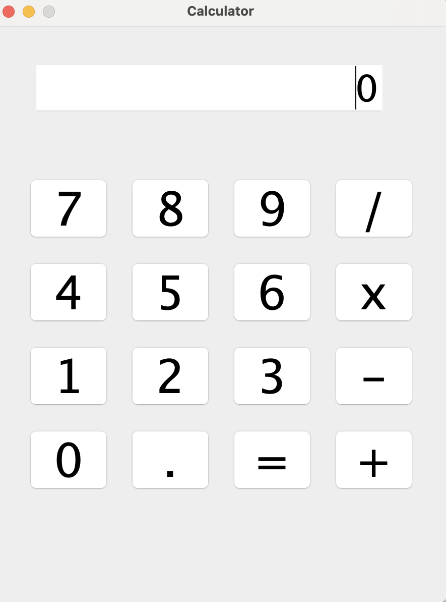

# 🧮 Calculator GUI

A simple and user-friendly desktop calculator application built with Java Swing. This project supports basic arithmetic operations such as addition, subtraction, multiplication, and division.

## 🚀 Features

- Built using Java Swing for the graphical user interface
- Supports four basic operations: Add, Subtract, Multiply, Divide
- Input via buttons
- Well-structured code using layers like `Service`, `GUI`, and `Constants`

## 🖼️ Interface Preview

## 🧩 Project Structure

CalculatorGui/
├── src/
│   ├── CalculatorApp.java               # Entry point of the application
│   ├── service/CalculatorService.java   # Business logic (arithmetic operations)
│   ├── gui/CalculatorGui.java           # GUI implementation using Swing
│   └── constants/CommonConstants.java   # Constants used in the app
├── .gitignore
├── README.md
